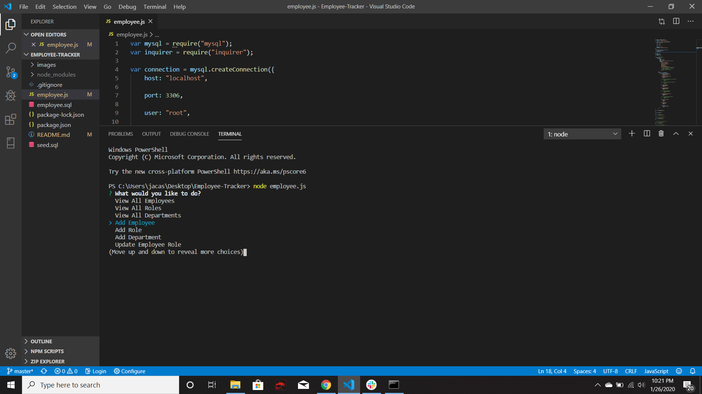
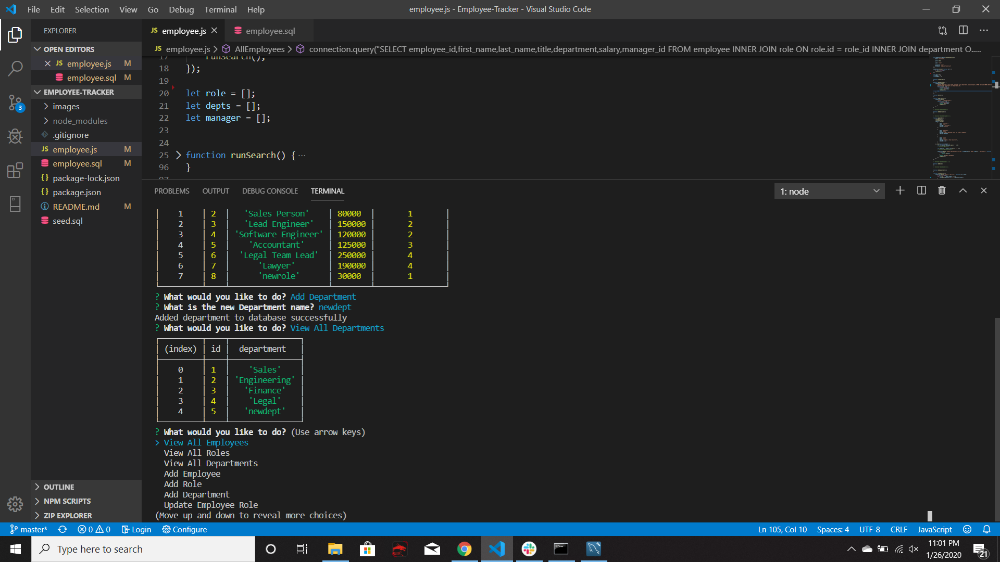
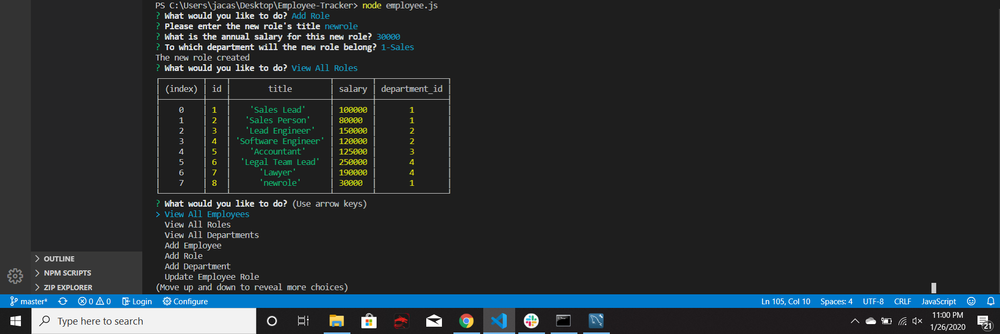
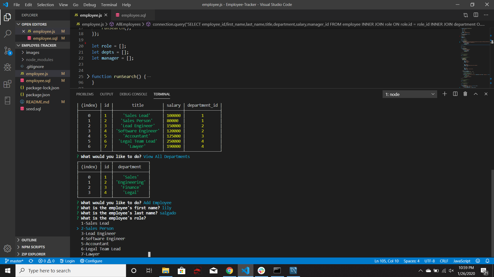
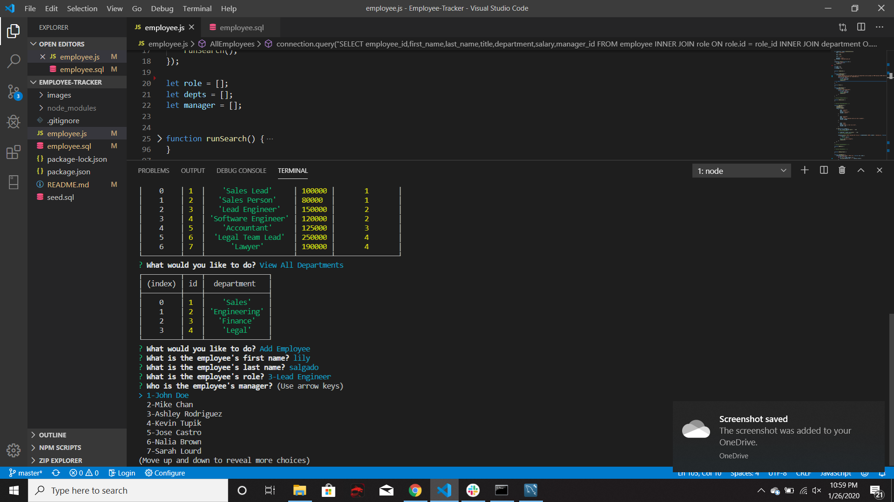
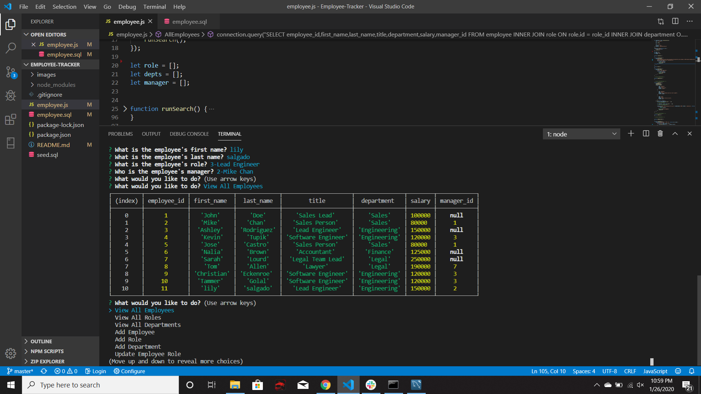
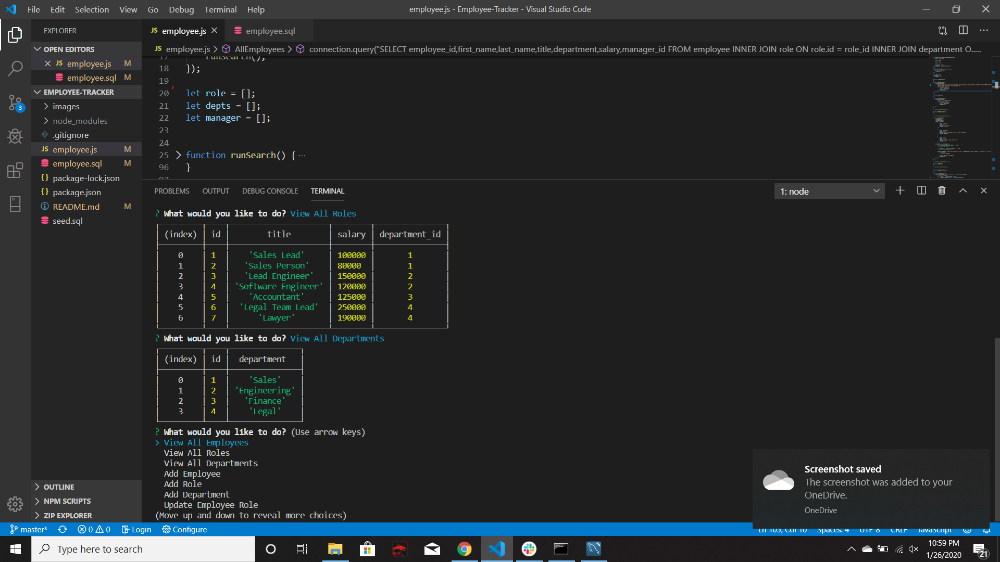
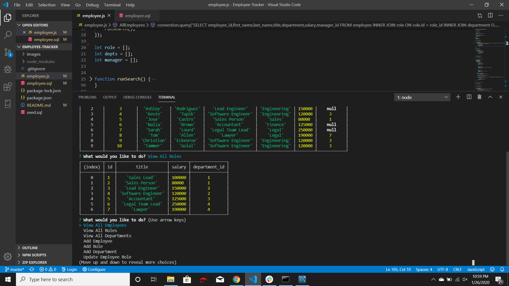
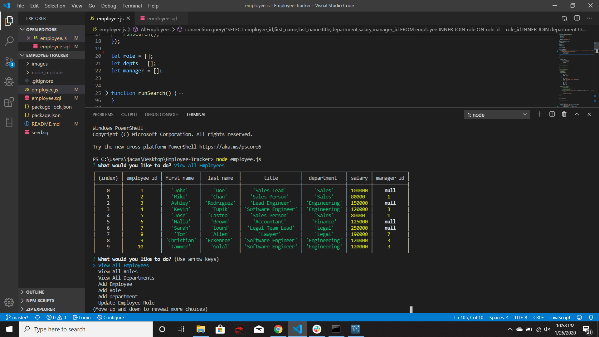
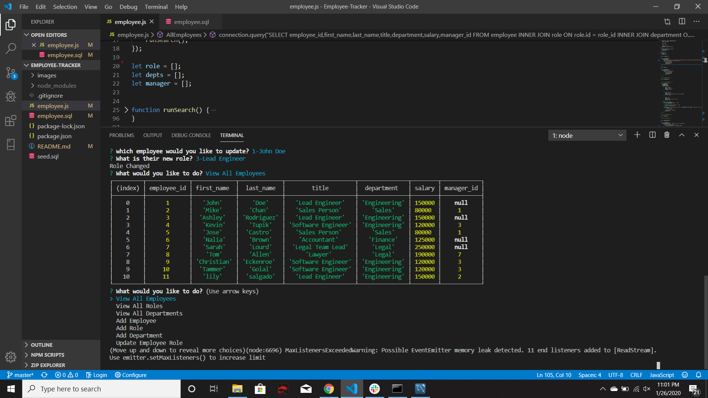

# Employee-Tracker
*  In this homework assignment, your challenge is to architect and build a solution for managing a company's employees using node, inquirer, and MySQL.

* Build a command-line application that at a minimum allows the user to: Add departments, roles, employees,View departments, roles, employees and Update employee roles.

## Usage
* To Use this command-line application, You have to install inquierer and mysql npm packages.

* Inside the terminal, type node employee.js to start the command-line application.

* Once the application is started, the user will be promted with a list of items from which they can select what to do.

* Based on user choices, the application will either show them some data or ask questions based on what they are trying to do and input the data.

## Reocuring Errors
* Linking the three separate tables, was a bit of a struggle since they all contained different data.

* When calling a function to fill an array I kept trying to do it on the global scope, until i realized that I needed to call those functions inside of the function which would use the selected array.

* Sometimes whenever I could select an option it would cause the application to end, which wasnt what i wanted and had to move functions arround.

## Future Improvements
* Right now I have various functions and selections commented out because I could not get them to work.

* These functions include, removing an employee, viewing employees based on manager, or roles.

* I would like to get these functions and selections to work in the future.

## Minimum Requirements and screenshots

* Functional application.

* GitHub repository with a unique name and a README describing the project.

* The command-line application should allow users to:

  * Starting Application:

  * Add departments:
  
  * Add roles:
  
  * Add employees:
  ask for role
  
  ask for manager
  
  shows it was added
  

  * View departments:
  
  * View roles:
  
  * View employees:
  
  * Update employee roles:
  Updated role and viewed employes again to show that it changed from sales Lead to Lead Engineer
  